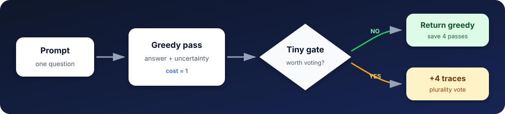
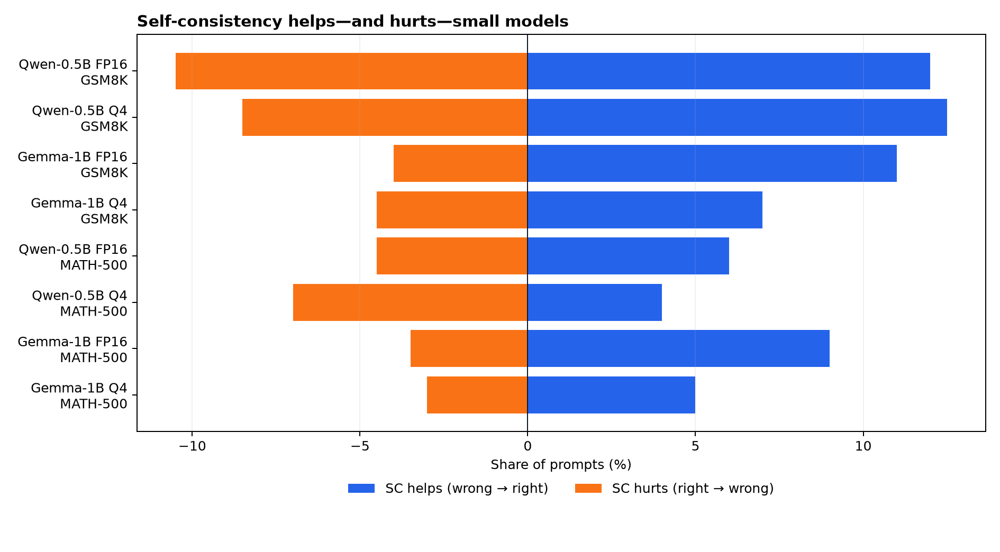
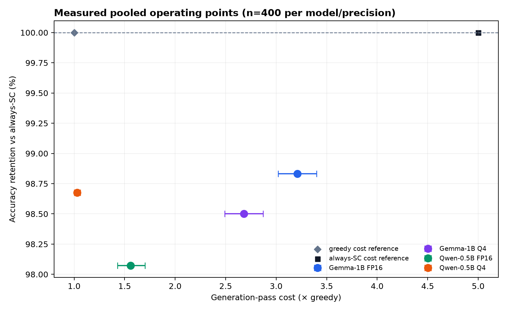

<div align="center">

# SiftSC

### Stop voting on every prompt.

**Selective self-consistency for small, local language models.**<br>
Run one deterministic answer, inspect its uncertainty, and spend extra inference only when a tiny gate says it may help.

[](https://github.com/heywanrong/SiftSC/actions/workflows/ci.yml)
[](https://www.python.org/)
[](https://github.com/ml-explore/mlx)
[](LICENSE)



</div>

Self-consistency (SC) normally samples several reasoning traces for every prompt and plurality-votes. Our ICONIP 2026 study found that this default can waste compute—and sometimes lower accuracy—on models at or below 1B parameters. **SiftSC turns that finding into a usable tool:** a model-local gate decides after the first pass whether to keep the greedy answer or draw the remaining SC samples.

```python
from siftsc import MLXBackend, SiftSC, load_profile, math_prompt

router = SiftSC(
    backend=MLXBackend("./models/mlx/qwen05b-q4"),
    gate=load_profile("qwen05b-q4-confidence"),
    samples=5,
)

question = "A shop sold 18 books on Monday and twice as many on Tuesday. Total?"
result = router(math_prompt(question), feature_text=question)

print(result.text)
print(result.used_self_consistency, result.generation_passes)
```

The return value exposes the route, gate score, threshold, all extracted features, every generated trace, vote counts, and total generation passes. No hidden cloud calls, auxiliary verifier, or fine-tuning are required.

## Why selective SC?

Across 1,600 prompt-level observations from Qwen-2.5-0.5B-Instruct and Gemma-3-1B-it in FP16 and MLX-Q4, SC@5 changed answers in both directions. Blue is the fraction it repaired; orange is the fraction it broke.



| Model | Dataset | Greedy | SC@5 | SC helps | SC hurts | Net gain |
|---|---:|---:|---:|---:|---:|---:|
| Qwen-0.5B FP16 | GSM8K | 39.0% | 40.5% | 12.0% | 10.5% | +1.5 pt |
| Qwen-0.5B Q4 | GSM8K | 20.5% | 24.5% | 12.5% | 8.5% | +4.0 pt |
| Gemma-1B FP16 | GSM8K | 37.5% | 44.5% | 11.0% | 4.0% | +7.0 pt |
| Gemma-1B Q4 | GSM8K | 15.0% | 17.5% | 7.0% | 4.5% | +2.5 pt |
| Qwen-0.5B FP16 | MATH-500 | 18.0% | 19.5% | 6.0% | 4.5% | +1.5 pt |
| **Qwen-0.5B Q4** | **MATH-500** | **12.5%** | **9.5%** | **4.0%** | **7.0%** | **−3.0 pt** |
| Gemma-1B FP16 | MATH-500 | 22.5% | 28.0% | 9.0% | 3.5% | +5.5 pt |
| Gemma-1B Q4 | MATH-500 | 10.0% | 12.0% | 5.0% | 3.0% | +2.0 pt |

Each row contains 200 prompts and one generation seed. Source-level checksums are in [`docs/benchmarks/per_task.csv`](docs/benchmarks/per_task.csv). These are the paper's measured results, not synthetic examples.

## Measured operating points

The bundled profiles reproduce the paper's selected pooled operating points (400 prompts per model/precision, 1,000 paired bootstrap resamples). A cost of 1 is one greedy generation; always-SC@5 costs 5.



| Profile | Gate | SC calls skipped (95% CI) | Cost | Accuracy retention* |
|---|---|---:|---:|---:|
| Qwen-0.5B FP16 | logistic | 86.0% [82.5, 89.3] | 1.56× | 98.1% |
| Qwen-0.5B Q4 | confidence | 99.3% [98.5, 100.0] | 1.03× | 98.7% |
| Gemma-1B FP16 | logistic | 44.7% [40.0, 49.5] | 3.21× | 98.8% |
| Gemma-1B Q4 | logistic | 57.9% [53.2, 62.7] | 2.68× | 98.5% |

\* Accuracy retention values are point estimates relative to always-SC. Their bootstrap intervals are wide because SC accuracy is only 15–36% in these small-model cells; see [`docs/benchmarks/RESULTS.md`](docs/benchmarks/RESULTS.md) for the intervals and interpretation. Thresholds were selected on the same out-of-fold pool, so treat them as research profiles and recalibrate before high-stakes deployment.

## Install

SiftSC is currently a private preview. Clone the repository, then install the MLX extra on an Apple-Silicon Mac:

```bash
git clone https://github.com/heywanrong/SiftSC.git
cd SiftSC
python -m pip install -e '.[mlx]'
```

The core package depends only on NumPy. MLX is lazy-loaded, so custom or server backends can use the routing logic on Linux and Windows too.

## Try it from the terminal

```bash
siftsc profiles

siftsc ask "If 3 notebooks cost £4 each, what is the total?" \
  --model ./models/mlx/qwen05b-q4 \
  --profile qwen05b-q4-confidence
```

Machine-readable mode makes the decision auditable:

```bash
siftsc ask "What is 17 × 6?" \
  --model ./models/mlx/qwen05b-q4 \
  --profile qwen05b-q4-confidence \
  --json > decision.json
```

Example route summary:

```text
[siftsc] route=greedy score=0.229 threshold=0.915 passes=1/5
```

The release was smoke-tested against the locally cached MLX-Q4 Qwen model on Apple Silicon:

| Test route | Parsed answer for `7 + 5` | Passes | Vote |
|---|---:|---:|---:|
| Bundled default profile | 12 | 1/5 | greedy accepted |
| Forced SC path | 12 | 5/5 | 5 votes for 12 |

The scrubbed machine-readable report records Python, MLX, and `mlx-lm` versions in [`docs/benchmarks/local_mlx_smoke.json`](docs/benchmarks/local_mlx_smoke.json).

Override `--threshold 0` to force the SC path for inspection, or `--threshold 1.1` to force the one-pass path. Lower thresholds invoke SC more often.

## How it works

SiftSC implements two gates from the paper:

| Gate | Inputs available after pass 1 | Learned parameters | Best use |
|---|---|---:|---|
| `confidence` | Mean top-1 minus top-2 token probability margin | One threshold | Homogeneous workloads and tiny calibration sets |
| `logistic` | 4 greedy statistics + 8 prompt counts | 12 weights + bias | Mixed tasks with at least a few hundred calibration prompts |

The 12 logistic features are mean token margin, top-5 entropy, full-vocabulary entropy, answer length, and counts of characters, words, digits, arithmetic operators, question marks, commas, lines, and multi-step connectives. All model statistics come from the greedy pass already needed for the fallback answer.

If the gate invokes SC, SiftSC reuses the greedy trace as vote 1 and draws `N−1` stochastic traces. That makes the deployed cost exactly:

```text
cost = 1 + (N - 1) × invoke_rate
```

The paper's accuracy measurements used five fresh stochastic traces; its cost analysis—and this implementation—uses the deployment-efficient `greedy + (N−1)` construction. This difference is documented rather than silently conflated.

## Bring your own model backend

Implement one `generate` method returning `Generation`:

```python
from siftsc import Generation


class MyBackend:
    def generate(self, prompt, *, greedy, seed, max_tokens, temperature, top_p):
        response, token_stats = my_inference_call(...)
        return Generation(
            text=response,
            token_ids=tuple(token_stats.ids),
            top_logits=tuple(token_stats.top5_logits),
            entropies=tuple(token_stats.entropies),
            sum_logprob=token_stats.sum_logprob,
        )
```

Confidence and logistic profiles require per-token logits. If your provider does not expose them, implement a custom gate over the prompt metadata or calibrate a text-only profile.

## Reproduce the release artifacts

This repository is independent of the paper's experiment tree. It ships only aggregate CSVs, plots, and kilobyte-scale gate profiles. If you have the paper repository locally, rebuild every shipped artifact with:

```bash
python scripts/build_release_assets.py --paper-root /path/to/ICONIP
```

Profile provenance—including SHA-256 hashes of the exact source record files—is stored inside each JSON profile and in [`docs/benchmarks/profile_manifest.json`](docs/benchmarks/profile_manifest.json).

For development:

```bash
python -m pip install -e '.[dev,mlx]'
ruff check .
ruff format --check .
mypy src/siftsc
pytest --cov=siftsc --cov-report=term-missing
```

Set `SIFTSC_MLX_MODEL=/absolute/path/to/model` to include the real local-model integration test.

## Scope and limitations

- Evidence currently covers SC@5, two ≤1B model families, two precisions, two math benchmarks, and one generation seed per cell.
- Bundled thresholds are tied to the paper's prompt format and model/precision cell. Recalibrate for a different model, task distribution, decoding setup, or risk tolerance.
- The gate predicts where SC repaired a wrong greedy answer; it is not a correctness verifier.
- Retention is a ratio with a low-accuracy denominator in these experiments. Skip-rate estimates are tighter than retention estimates.
- SiftSC is experimental research software. Do not use it as the sole decision-maker in safety-critical or high-stakes systems.

## Citation

If SiftSC helps your work, please cite the accompanying paper:

```bibtex
@inproceedings{yang2026selfconsistencyhurts,
  title     = {When Self-Consistency Hurts: The Hidden Cost of Majority Voting in Small Language Models},
  author    = {Yang, Wanrong and Li, Lingfang and Zhang, Jun and Wojtczak, Dominik},
  booktitle = {International Conference on Neural Information Processing},
  year      = {2026},
  note      = {Forthcoming}
}
```

## License

Apache-2.0. See [LICENSE](LICENSE). The bundled profiles are derived artifacts from the authors' experiment records; no model weights or benchmark examples are redistributed.
