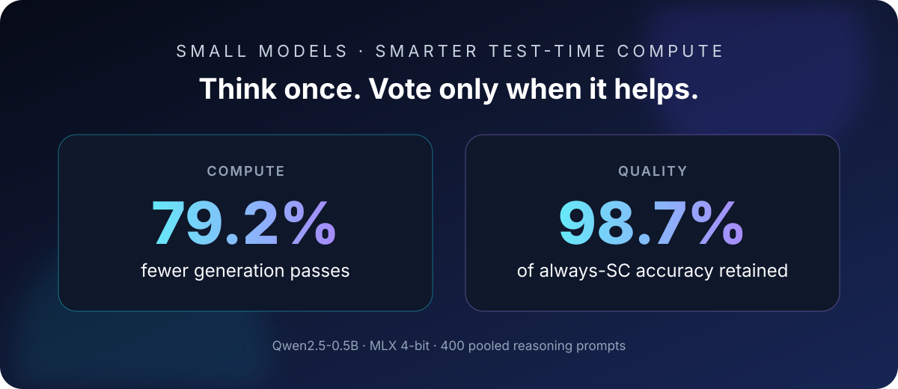

<div align="center">

<h1>
  
  &nbsp;SiftSC
</h1>

### Think once. Vote only when it helps.

**Selective self-consistency for small, local language models.**<br>
No API key · No fine-tuning · No cloud inference

<a href="https://github.com/heywanrong/SiftSC/actions/workflows/ci.yml"></a>
<a href="https://www.python.org/"></a>
<a href="LICENSE"></a>

<br>


<a href="#run-it-now"></a>
&nbsp;
<a href="#chat-with-the-model"></a>

</div>

> [!IMPORTANT]
> **The bundled demo and interactive chat currently require an Apple-Silicon Mac (M1 or newer).** Model inference uses MLX. The NumPy routing core is cross-platform through custom backends, but a built-in Linux or Windows model runner is not included yet.

Self-consistency can help a small model—but running it on every prompt spends five generation passes, and the majority can still overturn a correct answer. SiftSC makes that vote conditional: answer once, inspect cheap signals from the same pass, and sample five reasoning traces only when the router decides they are worth the compute.

**The result on our 400-prompt Qwen-0.5B workload: 79.2% fewer generation passes while retaining 98.7% of Always-SC accuracy.**

<table>
  <tr>
    <td width="33%" valign="top"><strong>⚡ Spend selectively</strong><br>Use one pass by default. Pay for five voters only when the router escalates.</td>
    <td width="33%" valign="top"><strong>🛡️ Protect good answers</strong><br>Avoid some cases where blind majority voting replaces a correct first answer.</td>
    <td width="33%" valign="top"><strong>🔎 See every decision</strong><br>Inspect the route, votes, actual passes, and compute saved after every answer.</td>
  </tr>
</table>

<p align="center">
  
</p>

<a id="run-it-now"></a>

## 🚀 One command. Two modes. Zero setup.

On an Apple-Silicon Mac with Python 3.11+, this single command installs SiftSC, downloads the tested public 4-bit model, runs the complete comparison, **then keeps the model loaded so you can type your own questions immediately**:

```bash
python -m pip install -q --upgrade "siftsc[mlx] @ git+https://github.com/heywanrong/SiftSC.git" && siftsc demo
```

The same command upgrades an existing installation; `siftsc --version` shows which release you have. The `-q` keeps pip to warnings and errors. SiftSC itself prints only what matters: a one-line download progress on the first launch, a loading spinner, the two verified cases, and your prompt. Library chatter from the model stack is captured and shown only when loading fails or `SIFTSC_VERBOSE=1` is set.

> [!NOTE]
> **Private-preview requirement:** until this repository is made public, GitHub must be reachable and your Git client must be authenticated as a collaborator. This requirement disappears for the public release.

<details>
<summary><strong>🧯 Seeing “Failed to connect to github.com port 443”?</strong></summary>

That message is raised by `git clone` before SiftSC or its build process starts. Verify GitHub connectivity and private-repository access:

```bash
curl -I https://github.com
gh auth status
gh auth setup-git
git ls-remote https://github.com/heywanrong/SiftSC.git HEAD
```

If `curl` cannot connect, restore the terminal's network/VPN/proxy access and retry. If `git ls-remote` prints a commit hash, the original installation command is ready to run again.

Already have a local clone? Bypass GitHub completely:

```bash
cd /path/to/SiftSC
python -m pip install -q --upgrade '.[mlx]' && siftsc demo
```

</details>

<table>
  <tr>
    <td width="33%" valign="top"><strong>1 · 📦 Install</strong><br>The command installs the CLI and MLX backend quietly.</td>
    <td width="33%" valign="top"><strong>2 · 🤖 Download</strong><br>The pinned 290 MB Qwen model is fetched once with a live MB counter, then cached locally.</td>
    <td width="33%" valign="top"><strong>3 · 🧪 Compare & chat</strong><br>Watch the verified cases, then ask your own questions without reloading.</td>
  </tr>
</table>

The bundled model is [`mlx-community/Qwen2.5-0.5B-Instruct-4bit`](https://huggingface.co/mlx-community/Qwen2.5-0.5B-Instruct-4bit/tree/a5339a4131f135d0fdc6a5c8b5bbed2753bbe0f3). Its tested revision is pinned, so every later run starts from the same local checkpoint.

### 🧪 One model, two decisions: repair and protect

These are real outputs from the public model with `mlx-lm 0.31.3`, not mocked transcripts. The command pins the questions, decoding seed, and demo threshold—and fails loudly if the behavior no longer reproduces.

#### 🛠️ Repair: vote when one answer is shaky

Plain inference latches onto a distractor. SiftSC escalates, and independent traces recover the correct two-step calculation:

```text
🗳️  CASE 1 · VOTE WHEN IT HELPS
Question   Henry made two stops during his 60-mile bike trip. He first stopped
           after 20 miles. His second stop was 15 miles before the end of the
           trip. How many miles did he travel between his first and second
           stops?
Expected   25
PLAIN      15  ✗   1 pass
SIFTSC     25  ✓   6 passes · votes 20 · 15 · 25 · 25 · 30
```

The second stop is at mile `60 - 15 = 45`; the distance between stops is `45 - 20 = 25`. Three of five independent traces reach `25`, so it wins the vote.

#### 🛡️ Protect: stop when voting would hurt

Here the first answer is already right. Always-SC votes itself into the wrong answer; SiftSC knows when to stop:

```text
🛡️  CASE 2 · SKIP WHEN VOTING HURTS
Question   Darrell and Allen's ages are in the ratio of 7:11. If their total age
           now is 162, calculate Allen's age 10 years from now.
Expected   109
PLAIN      109  ✓   1 pass
ALWAYS-SC  99  ✗   5 passes · blind voting changed a right answer
SIFTSC     109  ✓   1 pass · vote skipped
   ⚡ plain      █░░░░░   1 pass
   👥 always-SC  █████░   5 passes
   🧭 siftsc     █░░░░░   1 pass   ✅ saved 4 (80.0%)
```

One chart cell is one generation pass, so bar length is the compute cost. The losing always-SC answer can differ between machines; what is checked is that the blind vote loses the correct `109` while SiftSC keeps it.

#### 📉 See the compute drop

The demo ends with the measured workload-level result—not a theoretical estimate:

```text
📉 MEASURED WORKLOAD · 400 PROMPTS
   👥 always-SC  ████████████████████████████████  2,000 passes
   🧭 siftsc     ███████░░░░░░░░░░░░░░░░░░░░░░░░░    415 passes
   ✅ saved 1,585 passes · 79.2% less compute
   🎯 98.7% of always-SC accuracy retained
✅ Reproduced: repair when voting helps; skip when voting hurts.

🚀 YOUR TURN · The model stays loaded, ask your own question!
💡 Best at math word problems · each turn is independent · /help lists commands
💬 you · siftsc > _
```

Only want the reproducible showcase for a script or CI job? Run `siftsc demo --no-chat`. Piped and non-interactive runs also exit cleanly after the showcase.

<sub>Demo questions from the [GSM8K test set](https://github.com/openai/grade-school-math), released under the MIT License.</sub>

<a id="chat-with-the-model"></a>

## 💬 Ask anything from the same terminal

After `siftsc demo`, simply type at the `💬 you` prompt. Or start a fresh session and choose ordinary one-pass inference or SiftSC:

```bash
siftsc chat
```

```text
🚀 Choose a reasoning mode:
  1  ⚡ plain     one deterministic pass, never votes
  2  🧭 siftsc    votes only when the router escalates
  3  🔬 compare   runs plain, always-SC and siftsc on every question
✨ mode [2] >

🚀 Sifty is online · mode 🧭 siftsc · votes only when the router escalates
💬 you · siftsc > Henry made two stops during his 60-mile bike trip...
⣹  🧠 Sifty is deciding whether to call a vote
✨ Answer ready · 2.9s

🤖 Sifty
   Let's add the miles of the first and second stops: 20 + 15 = 35. That means
   he traveled 35 miles between the first and second stops. That means he
   traveled 60 - 35 = 25 miles between the first and second stops. Answer: 25.

🎯 Answer: 25 · 🗳️ vote called · votes 20 · 15 · 25 · 25 · 30 · 6 passes · 2.9s
   ⚡ plain      █░░░░░   1 pass   (the draft said 15)
   👥 always-SC  █████░   5 passes
   🧭 siftsc     ██████   6 passes 🛠️ vote changed the draft · ⚠️ extra 1 (+20.0%)
📊 session · 2 questions · 7 vs 10 passes · saved 3 (30.0%) vs always-SC
```

Every answer ends with a highlighted `🎯 Answer` line, the route the router took, and a compute chart in which one cell is one generation pass. The spinner animates during model loading and reasoning; animation switches off for pipes and CI logs, or set `SIFTSC_NO_ANIMATION=1`. Arrow keys and history work at the prompt, and Ctrl-C stops the current answer without leaving the session.

### 🔀 Switch modes without reloading

Change the inference policy at any time while the model stays in memory:

```text
/plain     ⚡ one deterministic pass, never votes
/siftsc    🧭 votes only when the router escalates
/compare   🔬 runs plain, always-SC and siftsc on every question
/stats     📊 show the session compute chart
/clear     🧹 clear the screen
/help      🧭 show these commands
/exit      👋 leave SiftSC
```

Or select the mode before launch:

```bash
siftsc chat --mode plain
siftsc chat --mode siftsc
siftsc chat --mode compare
```

Each turn is treated as an independent reasoning question because the bundled router was calibrated on math reasoning, not open-ended conversation history.

### 🔬 Compare all three policies on one question

Compare mode answers with SiftSC and completes the always-SC baseline without waste: plain inference is exactly SiftSC's greedy draft, so it is never rerun, and when SiftSC called a vote the same five voters are the always-SC result. Every policy row shows its answer, its passes, and its measured time:

```text
💬 you · compare > A shop sold 18 books on Monday and twice as many on Tuesday. How many books in total?
✨ Comparison ready · 2.9s

🎯 Answer: 54 · 🛡️ first answer accepted · 1 pass · 2.9s for all three policies
🔬 COMPARE · one question, three policies
   ⚡ plain      █░░░░░  1 pass     0.6s  → 54
   👥 always-SC  █████░  5 passes   2.3s  → 54   votes 72 · 54 · 36 · 54 · 54
   🧭 siftsc     █░░░░░  1 pass     0.6s  → 54   🛡️ vote skipped
   🤝 all three policies agree
```

The same comparison is available for a single question with `siftsc ask "..." --mode compare`.

### 📟 Watch compute savings live

After every answer the CLI prints a one-line session total, and `/stats` draws the whole session:

```text
📊 SESSION · 3 questions · 1 vote called
   ⚡ plain      ██████░░░░░░░░░░░░░░░░░░     3 passes if all used one pass
   👥 always-SC  ████████████████████████    15 passes if all voted
   🧭 spent      █████████████████████░░░    13 passes ✅ saved 2 (13.3%)
   ⏱️  5.9s of generation · 1,170 tokens
```

Passes are the transparent compute proxy from the paper; seconds and tokens are measured on your machine.

## ⚡ The difference, in two numbers

| On Qwen2.5-0.5B MLX 4-bit | Always-SC@5 | SiftSC |
|---|---:|---:|
| Actual generation passes over 400 prompts | 2,000 | **415 · 79.2% fewer** |
| Accuracy relative to always-SC | 100% reference | **98.7% retained** |

The pass count uses conservative, auditable accounting: one routing draft for every prompt, plus five fresh voters for each of the three escalated prompts. The policy was measured on 400 pooled GSM8K and MATH-500 prompts; its threshold was selected out-of-fold and was not chosen on either demo question. Full confidence intervals, per-model results, checksums, and caveats live in [the benchmark report](docs/benchmarks/RESULTS.md), away from the quick-start path.

## 🧭 How SiftSC works

<table>
  <tr>
    <td width="33%" valign="top"><strong>① ✍️ Draft once</strong><br>Generate one deterministic answer and reuse signals already produced in that pass.</td>
    <td width="33%" valign="top"><strong>② 🧭 Route cheaply</strong><br>A tiny router adds a few prompt features. It never calls another language model.</td>
    <td width="33%" valign="top"><strong>③ 🗳️ Vote only if needed</strong><br>Easy prompts stop. Escalated prompts use five fresh traces matching SC@5.</td>
  </tr>
</table>

```text
prompt ──→ one draft ──→ route ──┬──→ accept now      · 1 pass
                                 └──→ sample + vote   · 6 actual passes
```

### ⌨️ Ask one question

Skip the interactive session and compare either policy directly:

```bash
siftsc ask "If 3 notebooks cost £4 each, what is the total?"
siftsc ask "If 3 notebooks cost £4 each, what is the total?" --mode plain
siftsc ask "If 3 notebooks cost £4 each, what is the total?" --mode compare --json
```

### 🧱 Bring your own local model

Point the CLI at any compatible local MLX directory instead of the default Hugging Face model:

```bash
siftsc chat --model /absolute/path/to/model
```

<details>
<summary><strong>🐍 Python API</strong></summary>

```python
from siftsc import MLXBackend, SiftSC, load_profile, math_prompt

question = "A shop sold 18 books on Monday and twice as many on Tuesday. Total?"
router = SiftSC(
    backend=MLXBackend("mlx-community/Qwen2.5-0.5B-Instruct-4bit"),
    gate=load_profile("qwen05b-q4-confidence"),
    samples=5,
)
result = router(math_prompt(question), feature_text=question)

print(result.parsed_answer)
print(result.used_self_consistency, result.generation_passes)
print(result.vote_counts)
```

`SiftResult` preserves the route, every generation, parsed answers, vote counts, and the actual number of model passes for auditing.

</details>

<details>
<summary><strong>🔬 Research scope and honest limitations</strong></summary>

- The published evidence covers SC@5, Qwen-0.5B and Gemma-1B, FP16 and MLX 4-bit, two math benchmarks, and one generation seed per cell.
- The headline result uses the paper's exact Qwen MLX-Q4 checkpoint and prompt distribution. The downloadable community conversion is provided for immediate experience, not as a claim that the published threshold transfers perfectly to every conversion.
- The demo and default public-model chat use a documented, slightly more permissive routing threshold so both the paper checkpoint and public conversion reproduce the same correction. They demonstrate the mechanism; they are not an aggregate benchmark.
- Escalation performs one routing draft plus five voter samples. The paper's normalized operating-point cost compares the selected SC@5 route with always-SC@5; the CLI reports actual model passes.
- Recalibrate before changing the model, task distribution, prompt template, decoding settings, or risk tolerance. SiftSC is not a correctness verifier and should not be the sole decision-maker in high-stakes systems.

See [benchmark details](docs/benchmarks/RESULTS.md), [ethics review](docs/ETHICS_REVIEW.md), and [profile provenance](docs/benchmarks/profile_manifest.json).

</details>

## 🧰 Develop

```bash
git clone https://github.com/heywanrong/SiftSC.git
cd SiftSC
python -m pip install -e '.[dev,mlx]'
ruff check . && mypy src/siftsc && pytest
```

The core router depends only on NumPy. MLX is loaded lazily, so custom backends can use the routing package on other platforms.

## 📚 Citation

```bibtex
@inproceedings{yang2026selfconsistencyhurts,
  title     = {When Self-Consistency Hurts: The Hidden Cost of Majority Voting in Small Language Models},
  author    = {Yang, Wanrong and Li, Lingfang and Zhang, Jun and Wojtczak, Dominik},
  booktitle = {International Conference on Neural Information Processing},
  year      = {2026},
  note      = {Forthcoming}
}
```

Apache-2.0. See [LICENSE](LICENSE).
